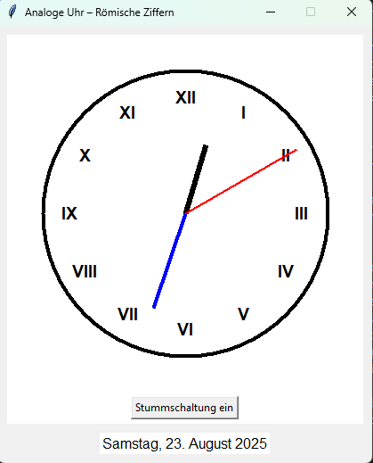

# Analoge Uhr – Römische Ziffern
Version 1.0.0

Eine kleine Desktop‑Anwendung, die eine analoge Uhr mit römischen Ziffern anzeigt, das aktuelle Datum ausgibt und bei jeder vollen Stunde einen Stundenschlag (Beep‑Töne) auslöst.
Die App ist komplett in Python geschrieben und benötigt lediglich das Standard‑tkinter‑Modul – keine zusätzlichen Abhängigkeiten.

## 📸 Screenshots
Uhr mit Datum und Stundenschlag

## 🚀 Features
Feature	Beschreibung
Römische Ziffern	Die Stunden 1–12 sind als I–XII angezeigt.
Beep‑Töne bei voller Stunde	Bei jeder vollen Stunde ertönen 1‑12 Töne (je nach Stunde).
Stummschaltung	Ein Button lässt den Stundenschlag jederzeit ein- oder ausschalten.
Aktuelles Datum	In deutscher Sprache (z. B. „Dienstag, 23. August 2025“) wird unter der Uhr angezeigt.
Keine externen Bibliotheken	Läuft mit Python 3.7+ und dem eingebauten tkinter.
⚙️ Installation
### 1. Repository klonen
git clone https://github.com/DEIN_USER/ANALOG_CLOCK.git
cd ANALOG_CLOCK

### 2. Optional: Virtuelles Environment (empfohlen)
python3 -m venv venv
source venv/bin/activate   # Windows: venv\Scripts\activate

### 3. Skript ausführen
python3 analog_clock.py
Hinweis:
Auf manchen Systemen muss tkinter separat installiert werden (z. B. sudo apt-get install python3-tk auf Debian/Ubuntu).

## 🎯 Nutzung
Die Uhr startet sofort mit aktueller Zeit und Datum.
Stummschaltung: Klicken Sie auf „Stummschaltung ein/aus“, um den Stundenschlag zu aktivieren bzw. zu deaktivieren.
Beep‑Sequenz: Bei jeder vollen Stunde ertönen n Töne, wobei n die aktuelle Stunde im 24‑Stunden‑Format ist (z. B. 13 Töne für 13 Uhr).
## 🛠️ Entwicklung
Branch‑Struktur

main – stabile Version (hier 1.0.0)
dev – laufende Entwicklung
Feature‑Branches nach Issue‑Nummer
Testen

Laufend python3 analog_clock.py ausführen, um die GUI zu testen.
GUI‑Tests sind nicht vorgesehen; prüfen Sie manuell.
Pull‑Requests

Bitte beschreiben Sie Änderungen klar und fügen Sie ggf. Screenshots hinzu.
Für größere Features: erstellen Sie ein Issue vorab.
## 📄 Lizenz
MIT License – siehe LICENSE.

## 📬 Kontakt
Autor: Dieter Eckstein
Issue‑Tracker: GitHub Issues
## 📦 Versionsgeschichte
Version	Datum	Änderungen
1.0.0	2025‑08‑23	Erstveröffentlichung: römische Ziffern, Stundenschlag, Datum, Stummschaltung
Viel Spaß beim Ticken der Uhr!